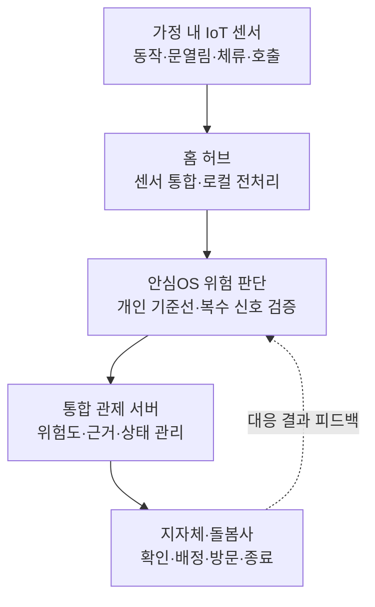

# 안심OS (Ansim OS)

> 독거노인 가정의 파편화된 안전 센서를 하나로 연결하고, 개인별 생활패턴에 맞춰 위험을 판단하는 지자체 통합 돌봄 플랫폼

**팀 감투 · 5인 팀 프로젝트 · 현재 단계: 기획/PRD 완료, 구현 전**

## 프로젝트 소개

안심OS는 1인 가구 독거노인의 낙상과 욕실 사고 같은 생활 위험을 더 정확하게 감지하고, 지자체와 돌봄 인력이 여러 가구의 위험 및 대응 상태를 한곳에서 관리하도록 돕는 IoT·SW 융합 프로젝트입니다.

기존 안전 시스템은 센서와 서비스가 개별적으로 동작해 위험 정보가 흩어지고, 단일 센서값에 의존할 경우 일상 행동을 사고로 판단하는 오탐이 발생할 수 있습니다. 안심OS는 여러 센서의 신호와 개인별 생활패턴을 함께 분석하고, 위험 확인부터 담당자 배정과 조치 종료까지 하나의 흐름으로 연결하는 것을 목표로 합니다.

## 해결하려는 문제

- **높은 오탐 가능성:** 하나의 센서나 고정 임계값만으로는 평소 행동과 실제 사고를 구분하기 어렵습니다.
- **파편화된 감지 체계:** 낙상, 욕실, 화재 등 위험별 시스템이 분리되어 가구 상태를 통합적으로 보기 어렵습니다.
- **대응 과정의 단절:** 감지 이후 본인 확인, 담당자 배정, 방문 및 조치 결과가 하나의 기록으로 이어지지 않습니다.
- **대규모 관리의 어려움:** 지자체 담당자가 여러 독거노인 가구의 위험 우선순위와 진행 상태를 동시에 파악하기 어렵습니다.

## 핵심 제안

안심OS는 가정마다 동일한 기준을 강제하지 않습니다. 초기 공통 기준선에서 시작해 거주자의 활동 시간, 공간별 체류, 움직임과 응답 패턴을 점차 학습합니다. 이상 상황이 발생하면 복수 신호를 교차검증하고 본인 확인을 거친 뒤, 위험이 지속될 때 담당 돌봄사와 지자체 관제로 전달합니다.



## 대표 시나리오: 욕실 이상 체류 및 낙상 가능성

1. 욕실 체류 시간이 개인의 평소 패턴보다 길어지고 움직임이 일정 시간 감지되지 않습니다.
2. 안심OS가 단일 센서값으로 즉시 신고하지 않고, 문 상태·움직임·체류 시간 등 복수 신호를 함께 확인합니다.
3. 스피커나 호출 장치를 통해 거주자에게 상태 확인을 요청합니다.
4. 응답이 없거나 추가 위험 신호가 확인되면 위험도를 높이고 관제시스템에 알립니다.
5. 담당자는 판단 근거와 가구 정보를 확인한 뒤 전화, 방문 또는 119 연계를 결정합니다.
6. 대응 결과를 기록해 이후 기준선과 운영 정책 개선에 활용합니다.

## 주요 기능

| 영역 | 기능 |
|---|---|
| 센서 통합 | 제조사와 목적이 다른 여러 IoT 센서 데이터를 공통 형식으로 수집 |
| 개인화 기준선 | 초기 평균 패턴에서 시작해 가구별 생활 리듬을 점진적으로 반영 |
| 다중 신호 검증 | 체류, 움직임, 문 상태, 응답 여부 등을 함께 분석해 위험도 산정 |
| 단계별 알림 | 본인 확인 → 돌봄사/담당자 → 지자체 관제 → 필요 시 긴급기관 연계 |
| 통합 관제 | 가구별 위험순위, 판단 근거, 담당자와 대응 상태를 한 화면에서 관리 |
| 대응 이력 | 확인·방문·조치·종료 과정을 기록해 책임성과 운영 품질 확보 |

## 대상과 사업 구조

| 구분 | 내용 |
|---|---|
| 직접 사용자 | 1인 가구 독거노인 |
| 운영 사용자 | 생활지원사, 돌봄사, 지자체 관제 담당자 |
| 주요 고객 | 지방자치단체 및 공공 돌봄기관 |
| 제안 모델 | 가구 단위 센서·허브 구축 + 관제 플랫폼 도입·운영 |
| 확장 대상 | 장애인 1인 가구, 만성질환자, 재가 돌봄 대상자, 고령자 공동주택 |

## 차별점

안심OS는 새로운 단일 센서를 만드는 프로젝트보다 **여러 감지 수단과 대응 주체를 연결하는 운영 계층**에 가깝습니다.

- 응급호출기: 사용자의 직접 조작 없이도 이상 징후를 탐지할 수 있도록 보완
- 단일 낙상 센서: 개인별 패턴과 복수 신호를 이용해 판단 근거를 확장
- 개별 스마트홈 기기: 위험 감지 이후 공공 돌봄 대응 프로세스까지 연결
- 기존 관제 서비스: 센서 통합, 위험 우선순위, 담당자 배정과 조치 이력을 하나의 흐름으로 관리

## 구현 구상

현재 저장소에는 실제 서비스 코드나 MVP가 포함되어 있지 않습니다. 아래 구성은 후속 프로토타입을 위한 제안입니다.

### 하드웨어

- ESP32 또는 Arduino 계열 홈 허브/센서 노드
- PIR 또는 mmWave 움직임 센서
- 문 열림 센서, 비상 호출 버튼
- 필요 시 습도·온도·수침 센서 및 스피커/마이크
- Wi-Fi, BLE, Zigbee 또는 MQTT 기반 통신

### 소프트웨어

- 센서 수집 및 공통 이벤트 변환 계층
- 개인 기준선과 규칙 기반 위험 점수 엔진
- 이벤트·가구·대응 이력 저장 API
- 지자체용 통합 관제 대시보드
- 개인정보 최소수집, 접근권한, 감사로그 및 장애 대응 체계

## 제안 검증 지표

- 실제 위험 탐지율과 미탐률
- 오탐 알림 비율 및 기존 방식 대비 감소폭
- 감지부터 담당자 확인까지 걸린 시간
- 알림별 판단 근거 제공률
- 담당자 1인당 관리 가능한 가구 수
- 시스템 가동률과 센서 통신 장애율
- 거주자·돌봄사·지자체 담당자의 수용성

수치는 실제 사용자 테스트와 지자체 운영 실증을 통해 검증해야 하며, 현재 문서의 목표값은 구현 성과를 의미하지 않습니다.

## 로드맵

- **1단계 — 기획:** 문제 정의, 이해관계자, 서비스 흐름, 유사 서비스, SWOT 및 사업성 정리
- **2단계 — 단일 가구 프로토타입:** 실제 센서 2~3종과 홈 허브로 욕실 이상 체류 시나리오 구현
- **3단계 — 관제 프로토타입:** 복수 가구 이벤트, 위험순위, 담당자 배정 및 상태관리 구현
- **4단계 — 개인화 검증:** 생활패턴 데이터로 기준선을 조정하고 오탐·미탐 비교
- **5단계 — 현장 실증:** 개인정보·책임 체계를 보완하고 지자체/돌봄기관과 제한적 실증

## 프로젝트 산출물

- [3분 기획 발표자료](./감투_안심OS_3분기획발표.pptx)
- [PRD 및 기획서](./감투_안심OS_PRD_기획서.docx)
- [프로젝트 생성 흐름 및 프롬프트 로그](./감투_안심OS_프로젝트_생성흐름_프롬프트로그.md)

## 저장소 구성

```text
.
├── README.md
├── 감투_안심OS_3분기획발표.pptx
├── 감투_안심OS_PRD_기획서.docx
├── 감투_안심OS_프로젝트_생성흐름_프롬프트로그.md
├── build_gamtu_pitch.mjs
├── build_presentation.mjs
└── build_prd.py
```

빌드 스크립트는 발표자료와 문서 산출물 생성에 사용되며, 렌더링 이미지와 검사 파일은 시각적 품질 확인용 중간 결과물입니다.

## 팀

**팀명:** 감투  
**팀원:** 5명

| 역할 | 이름 | 담당 |
|---|---|---|
| 프로젝트 리드 | TBD | 기획 총괄, 일정 및 발표 |
| IoT 설계 | TBD | 센서·허브·통신 구조 |
| 백엔드/데이터 | TBD | 이벤트 모델, 위험 판단, API |
| 프론트엔드/UX | TBD | 관제 대시보드와 사용자 흐름 |
| 리서치/사업 | TBD | 문제 근거, 유사 서비스, 시장성과 SWOT |

실제 팀 역할에 맞게 이름과 담당을 수정해 주세요.

## 유의사항

- 본 프로젝트는 현재 **기획 단계의 학생 프로젝트**입니다.
- 의료적 진단이나 긴급기관의 판단을 대체하지 않으며, 실제 배포 전 안전성·개인정보·책임 주체 검토가 필요합니다.
- 카메라 중심 감시보다 비영상 센서와 최소한의 데이터 수집을 우선하고, 거주자의 동의와 통제권을 설계 원칙으로 둡니다.

---

**안심OS의 목표는 센서를 더 많이 설치하는 것이 아니라, 흩어진 신호를 더 정확한 판단과 더 빠른 돌봄 대응으로 연결하는 것입니다.**
